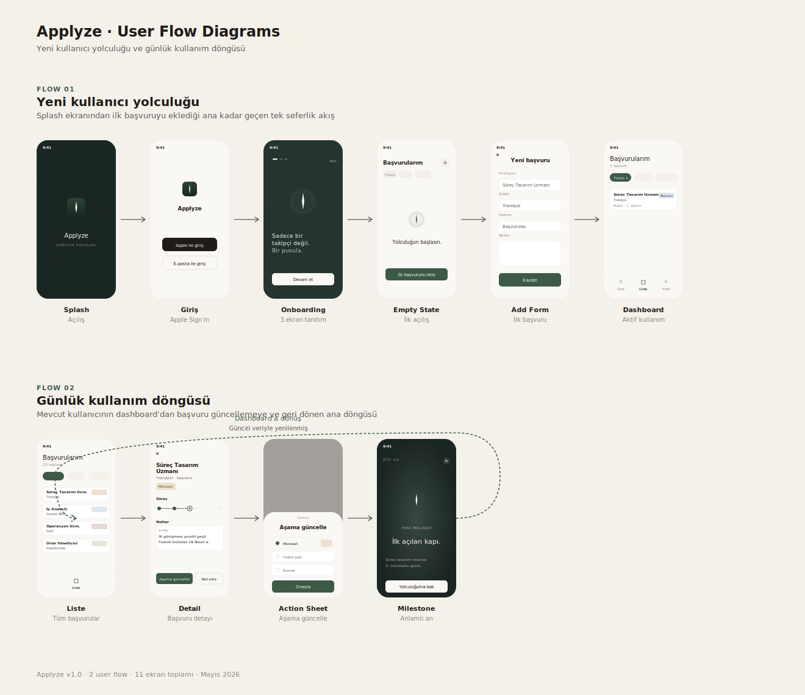
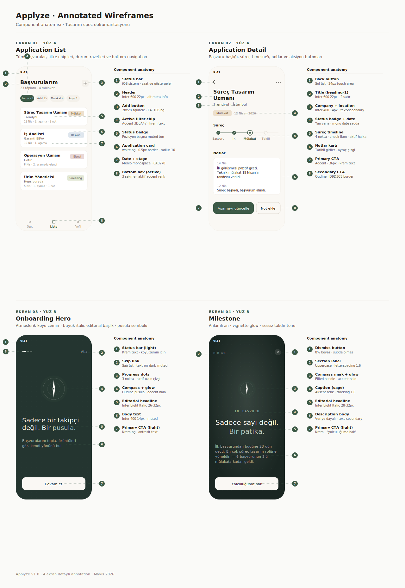

<div align="center">

# Applyze

**Kariyer pusulası.**  
Başvurularını sadece kayıt altına alma — yönünü gör.

</div>

<table align="center">
<tr>
<td></td>
<td></td>
<td></td>
</tr>
</table>

---

## Mevcut Durum

Backend (Supabase: şema, RLS, Auth, Edge Functions, cron) ayakta ve frontend'e bağlanmış durumda. Auth, başvuru CRUD, tekrar kontrolü ve günlük hareketsizlik bildirimleri canlıdır. Otomatik bilgi çekme Faz 0.2 araştırması sonrası v2'ye ertelendi (bkz. `docs/MVP_KAPSAM.md` §12).

| Katman | Durum |
|--------|-------|
| Tasarım sistemi (Yüz A / Yüz B + pusula sembolü) | ✅ Tamamlandı |
| Onboarding (3 ekran), Liste, Özet, Profil ekranları | ✅ Tamamlandı (mock veriyle) |
| Detay, başvuru ekleme, düzenleme, not ekleme akışı | ✅ Frontend hazır |
| Aşama yönetimi ve ayarlar ekranları | ✅ Frontend hazır |
| Milestone (Bir An) ekranı | ✅ Tamamlandı |
| Backend (Supabase + RLS + Auth) | 🔄 Sonraki sprint |
| Otomatik bilgi çekme | ❌ v2'ye ertelendi (Faz 0.2 — PerimeterX bot koruması) |
| Push bildirim ve elenme analizi | 🕐 Planlanan |

---

## Neden Applyze?

Mevcut iş takip araçları (Huntr, Teal, Simplify) Türk platformlarını desteklemiyor. Applyze bu boşluğu üç temel farklılaştırıcıyla kapatıyor:

- **Yerel platform desteği** — Kariyer.net, Youthall, Anbean ve LinkedIn başvurularını tek arşivde organize et
- **Elenme analizi** — Hangi aşamada takıldığını gösteren içgörü ekranı
- **Gizlilik öncelikli bildirimler** — Kilit ekranında şirket adı görünmez

Hedef kullanıcı: 22-27 yaş, aktif iş arayan yeni mezunlar ve çalışırken kariyer değişikliği arayan profesyoneller.

---

## Tasarım Dili

Applyze "ayna" felsefesiyle tasarlandı: kullanıcının verisini gösterir, kararı dayatmaz. İki "yüz" üzerine kuruldu:

### Yüz A — Çalışma yüzeyleri

Liste, detay, ayarlar gibi günlük ekranlar. Krem zemin (`#FAF8F4`), adaçayı yeşili aksanı (`#3D5A47`), Inter sans-serif. Linear ve Things 3 ilhamlı; veri yoğun ama dingin.

<table>
<tr>
<td align="center"><br/><sub>Özet</sub></td>
<td align="center"><br/><sub>Liste</sub></td>
<td align="center"><br/><sub>Detay</sub></td>
</tr>
</table>

### Yüz B — Anlamlı an

Onboarding ve milestone gibi atmosferik ekranlar. Koyu zemin (`#1A2622`), italic editorial başlık (Inter Light Italic), pusula sembolü, vignette glow. Linear "Flows", Tiimo, Alan'dan ilham alındı.

<table>
<tr>
<td align="center"><br/><sub>Onboarding</sub></td>
<td align="center"><br/><sub>Bir An</sub></td>
<td align="center"><br/><sub>Profil</sub></td>
</tr>
</table>

### Görsel kimlik

Sembol: **pusula iğnesi** — sessiz bir araç. Kullanıcı reddedildiğinde "üzgün maskot" görmez; pusula sadece yön değiştirir. Tipografi tek aile: Inter Variable. Renk paleti: krem nötrler + adaçayı yeşili + her duruma "bilinçli olarak donuk" rozetler (özellikle red için soluk gül — psikolojik bakım).

---

## User Flow

İki ana akış: yeni kullanıcı yolculuğu (tek seferlik) ve günlük kullanım döngüsü.



---

## Wireframe

Her kritik ekran component-component dökümante edildi. Her hotspot'un design system'deki karşılığı (token, ölçü, davranış) yanda etiketli.



---

## Ekran Turu

### Açılış ve onboarding

<table>
<tr>
<td align="center"><br/><sub>Splash</sub></td>
<td align="center"><br/><sub>Giriş</sub></td>
<td align="center"><br/><sub>Onboarding 1</sub></td>
<td align="center"><br/><sub>Onboarding 3</sub></td>
</tr>
</table>

### Özet (Dashboard)

Pulse band ile günün özeti, üç metrik, yolun haritası, geri dönüş bekleyenler ve "Pusulan şunları söylüyor" akıllı öneri kartı (backend bağlandığında aktive olacak).

<table>
<tr>
<td></td>
<td></td>
<td></td>
</tr>
</table>

### Liste ve detay

Başvuruları platforma, aşamaya, favorilere göre filtrele. Detay ekranında süreç timeline'ı, notlar ve ilan kaynağı.

<table>
<tr>
<td align="center"><br/><sub>Liste</sub></td>
<td align="center"><br/><sub>Detay (LinkedIn)</sub></td>
<td align="center"><br/><sub>Detay (Anbean)</sub></td>
</tr>
</table>

### Etkileşimler

<table>
<tr>
<td align="center"><br/><sub>Not ekle</sub></td>
<td align="center"><br/><sub>Düzenle / Sil</sub></td>
<td align="center"><br/><sub>Bir An (mülakat)</sub></td>
</tr>
</table>

### Profil ve ayarlar

<table>
<tr>
<td></td>
<td></td>
</tr>
</table>

---

## Teknoloji

| Katman | Teknoloji |
|--------|-----------|
| Mobil framework | Expo (React Native) — iOS & Android |
| Stiller | NativeWind (Tailwind for React Native) |
| Tipler | TypeScript (strict mode) |
| Gezinme | Expo Router (file-based navigation) |
| Tasarım sistemi | Inter Variable Font + design system v3 token'ları |
| SVG ve pusula sembolü | react-native-svg |
| Backend | Supabase (PostgreSQL + RLS + Edge Functions + Cron) |
| Bildirimler *(planlanan)* | Expo Notifications + Supabase Cron |
| Analitik *(planlanan)* | Amplitude |
| Dağıtım *(planlanan)* | Expo EAS Build → App Store + Google Play |

---

## Çalıştırma

**Gereksinimler:** Node.js 18+, npm, [Expo Go](https://expo.dev/client) uygulaması (iOS veya Android telefonda).

```bash
git clone https://github.com/basakilgu/Applyze.git
cd Applyze/frontend
npm install
npx expo start
```

Terminalde QR kod çıkar. Telefondaki Expo Go uygulamasıyla okuttuğunuzda uygulama açılır. Mock veriyle çalışır — backend bağlantısı veya `.env` ayarı gerekmez.

---

## Proje Yapısı

```
Applyze/
├── docs/
│   ├── design/                    # User flow + wireframe SVG'leri
│   └── screenshots/               # Uygulama ekran görüntüleri
├── frontend/                      # Expo (React Native) uygulaması
│   ├── app/
│   │   ├── (auth)/                # Giriş ekranı
│   │   ├── (onboarding)/          # 3 ekranlı onboarding (Yüz B)
│   │   ├── (tabs)/
│   │   │   ├── index.tsx          # Liste
│   │   │   ├── dashboard.tsx      # Özet
│   │   │   └── profile.tsx        # Profil
│   │   ├── application/           # Detay, yeni başvuru, düzenle
│   │   ├── settings/              # Bildirim ve aşama ayarları
│   │   └── milestone.tsx          # Bir An (Yüz B)
│   ├── components/ui/             # Card, Badge, Button, CompassMark, BottomSheet, ...
│   ├── lib/
│   │   └── mockData.ts            # Şu an demo verisi
│   ├── types/                     # TypeScript tipleri
│   └── tailwind.config.js         # Design system token'ları
├── backend/                       # Supabase yapılandırması (planlanan)
├── MVP_KAPSAM.md                  # MVP kapsam dokümanı
├── PRD.md                         # Ürün gereksinimleri dokümanı
└── plan.md                        # Geliştirme planı (10 hafta)
```

---

## Yol Haritası

| Sprint | Odak | Durum |
|--------|------|-------|
| Sprint 0 — Tasarım | Yüz A/B sistemi, pusula sembolü, tüm ekran tasarımları | ✅ Tamamlandı |
| Sprint 1 — Mock demo | Frontend'in mock veriyle çalışır hâle gelmesi | ✅ Tamamlandı *(bu repo)* |
| Sprint 2 — Backend | Supabase, RLS, kimlik doğrulama, başvuru CRUD | 🔄 Sonraki |
| Sprint 4 — Bildirim ve analiz | Push bildirim (gizlilik öncelikli), elenme analizi | 🕐 Planlanan |
| Sprint 5 — Yayına alma | App Store + Google Play | 🕐 Planlanan |

Detaylar için [`plan.md`](plan.md), [`MVP_KAPSAM.md`](MVP_KAPSAM.md) ve [`PRD.md`](PRD.md).

---

## Belgeler

- [`MVP_KAPSAM.md`](MVP_KAPSAM.md) — Ürün vizyonu, pazar analizi, MVP kapsamı, persona ve metrikler
- [`PRD.md`](PRD.md) — Ürün gereksinimleri, fonksiyonel ve fonksiyonel olmayan gereksinimler, veri modeli
- [`plan.md`](plan.md) — 10 haftalık geliştirme planı, sprint sprint görev listesi

---

## Katkı

Bu proje şu an tek geliştirici tarafından yürütülmektedir. Hata bildirimleri ve öneriler için [Issues](https://github.com/basakilgu/Applyze/issues) bölümünü kullanabilirsiniz.

### Dal Stratejisi

```
main        → kararlı, yayına hazır kod
develop     → aktif geliştirme
feature/*   → yeni özellikler
```

---

## Lisans

MIT

---

<div align="center">

*Applyze — Kariyer pusulası. v1.0 — Tasarım demosu.*

</div>
